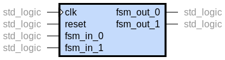

# FSM: Integration

Module top is: fsm.vhd

## Schemas

## AXI interface

## Generic description table

## Port description table

Port name | Type      | Description
--------- | --------- | -----------
clk       | std_logic | Clock
reset     | std_logic | Reset
fsm_in_0  | std_logic | Input 0
fsm_in_1  | std_logic | Input 1
fsm_out_0 | std_logic | Output 0
fsm_out_1 | std_logic | Output 1

## Other considerations

## Resources utilization

## Common errors
