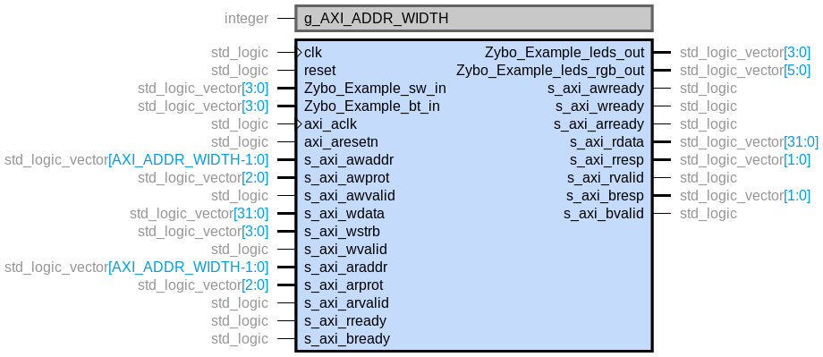

# Zybo_Example: Integration

Module top is: Zybo_Example.vhd

## Schemas

## AXI interface

Example:

OFFSET | LABEL                      | R/W | SC | DESCRIPTION                                      | RESET VALUE
:----: | -------------------------- | :-: | -- | ------------------------------------------------ | -----------
0x0000 | **Zybo_Example_VERSION**   |     |    |                                                  |             |
       | _[31:0] Version_           |  R  | NO | Version info                                     | VERSION     |
0x0004 | **Zybo_Example_CONFIG_ID** |     |    |                                                  |             |
       | _[31:0] Config ID_         |  R  | NO | Id Info                                          | CONFIG_ID   |
0x0008 | **Zybo_Example_COUNT**     |     |    |                                                  |             |
       | _[31:0] Count_             | R/W | NO | Count for the timer which changes the LED colour | 0x02000000  |

## Generic description table

Generic          | Type    | Description       | Tested values
---------------- | ------- | ----------------- | -------------
g_AXI_ADDR_WIDTH | integer | AXI address width | 4             |

## Port description table

Port name                 | Type                         | Description
------------------------- | ---------------------------- | ------------
clk                       | std_logic                    | clock
reset                     | std_logic                    | reset
Zybo_Example_sw_in        | std_logic_vector(3 downto 0) | switches
Zybo_Example_bt_in        | std_logic_vector(3 downto 0) | buttons
Zybo_Example_leds_out     | std_logic_vector(3 downto 0) | LEDs
Zybo_Example_leds_rgb_out | std_logic_vector(5 downto 0) | LEDs RGB
axi_aclk                  | std_logic                    | AXI clock
axi_aresetn               | std_logic                    | AXI reset
s_axi                     | Bus AXI-Lite                 | BUS AXI-Lite

## Other considerations

## Resources utilization

## Common errors
